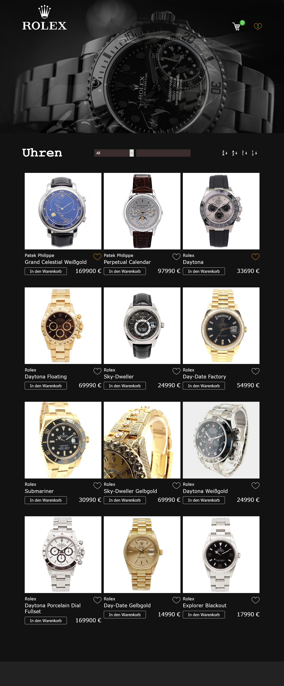

# Summary

In a four week course, the first three weeks were training and the last was project week.  
During alfatraining, I completed the following projects.  

There are three branches for the same project. Each section is a topic from the training. 
We had about five days (30hrs) to complete a project showing what we have learned.  
I chose a project I could expand more at each course.  
It began with a simple web shop without a backend and a database connection (branch js-basic).

In the second course, we dove into the basics of JavaScript.  
We learned the basics of nodejs and couchdb.  
At this point, I extended my project from the first course so much that I wrote a backend in nodejs which has a database connection with couchdb (branch js-advanced).

In the third course, we learned the basics of reactjs.  
Then I rewrote my project from the previous courses to reactjs (branch react-js).  
I’ve written above the branches of what I have learned in the courses and how I implemented it.  
My project was for training purposes and is not meant for production. 

"Product images used here in the project may not be reused or made public.  
Images are only used for the purpose of the project.  
However, the code may be used and adapted."

# The Features

### Sorting

- Sort by price ascending
- Sort by price descending
- Sorting alphabetically ascending
- Sorting alphabetically descending

### Searchbox

The search has some special features. You can search by specific category.  
For example, in the select box you can choose the category model and search by the name  of the model or brand and so on. 

Another special feature, is the “All” selection, in the select box.  
There the user can enter in the search field everything that is in the categories.  
For example, if you search “Sapphire” the function filters through all the categories and if something is found, the product is displayed.

You can narrow down the products by price.
For example:  

40000 :  displays all products that cost exactly 40000  
< 40000 :  displays all products that are less than 40000  
< 40000 :  returns all products greater than 40000  
\> 40000 < 70000 : gives all products in the range greater than 40000 and less than 70000

### Favorite List
The favorite products are saved in the Localstorage.

### Cart
All the items in the cart are saved as well in the Localstorage.

### Display Details 
In this feature, you can click on a product image to see the details of the watch in a Popup.

### Signed In User
A signed in user can see their purchases.

# Important Key Points to Run the Project
 - clone the repo or download the zip
 - cd alfatraining or got to the folder alfatraining
 - npm install
 - npm install -g json-server
 - npm install @types/react
 - npm install @types/react-dom
 - json-server --watch db.json -p 3001
 - yarn start
 
Open http://localhost:3000/ to view in the browser

# ReactJs: 

## Course contents

### Modern JavaScript frameworks and libraries (approx. 2 days)
- Basics of modern frontend frameworks
- Comparison of different frameworks
- Combination of frameworks

### Basics of React (approx. 3 days)
- Application structure
- Components
- Virtual DOM
- One Way Data Flow 

### React components (approx. 4 days)
- Components and their properties
- Functions and classes
- Status and life cycle
- Hierarchies of components
- Interactive components
- Event model and processing
- Communication between components
- Creating and validating forms
- Overview of the Redux ecosystem

### JSX (approx. 3 days)
- JavaScript expressions
- Lists
- Style specifications
- Render behavior
 
### Applications (approx. 3 days)
- Server connection
- React router
- Flux and Redux
- Server-side rendering

### Project work (approx. 5 days)
Presentation of the project results
